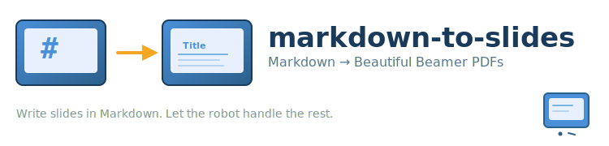
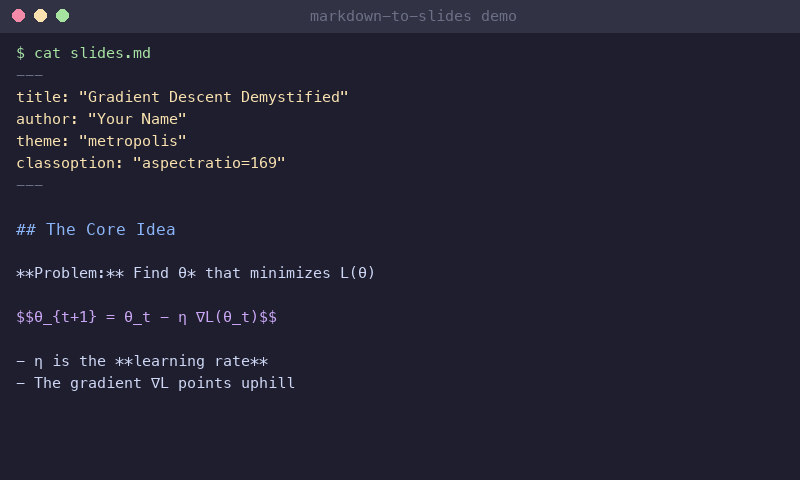
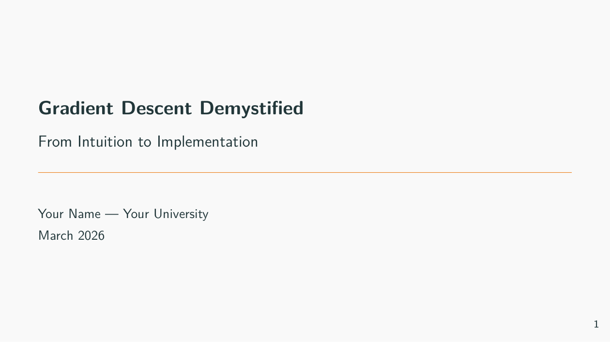
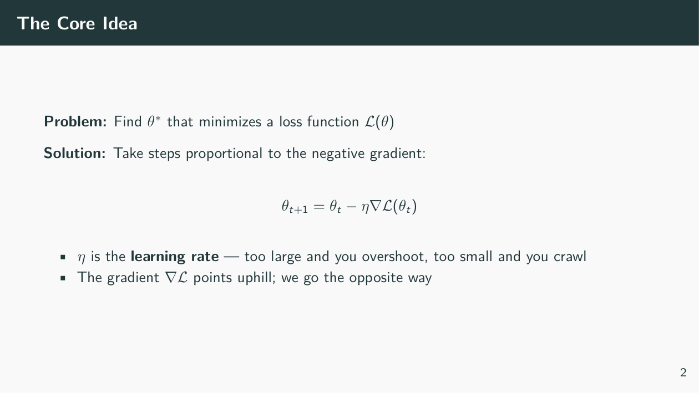
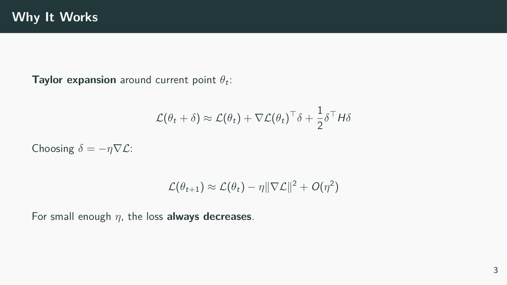
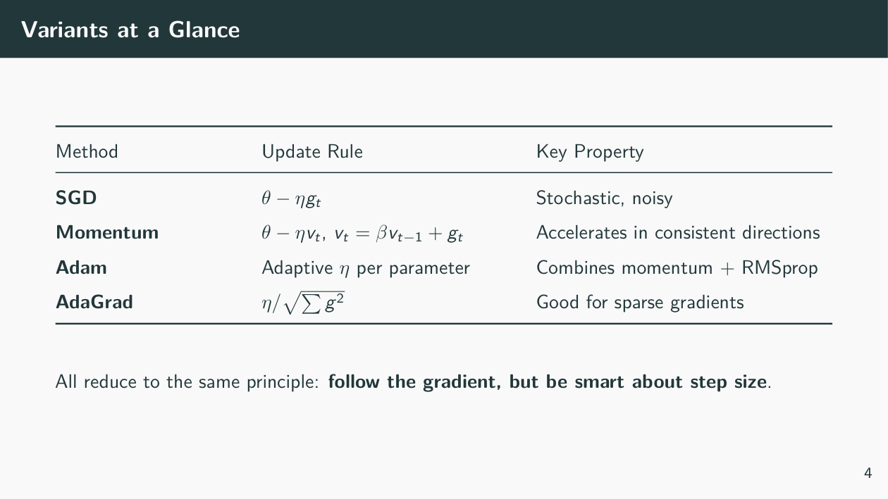
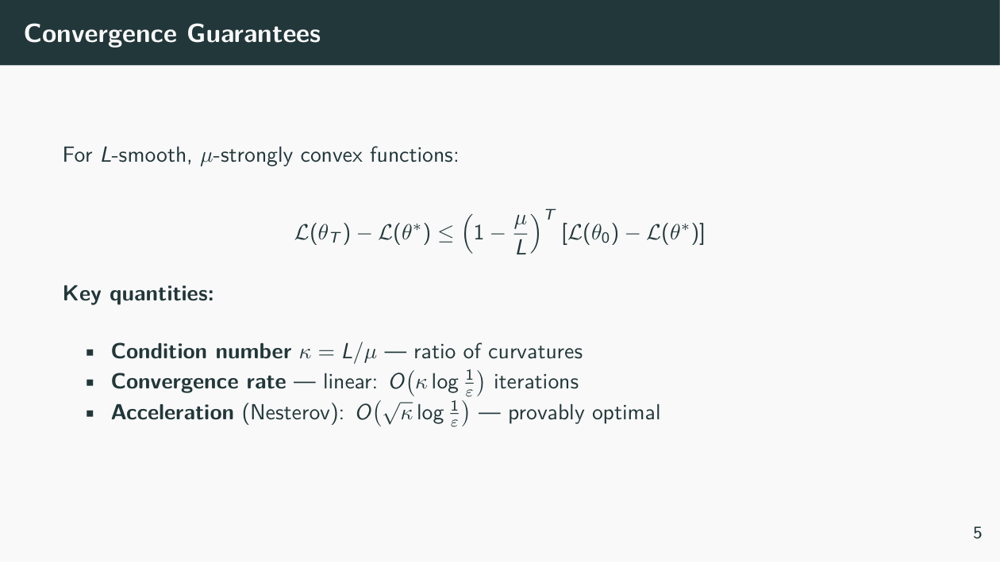
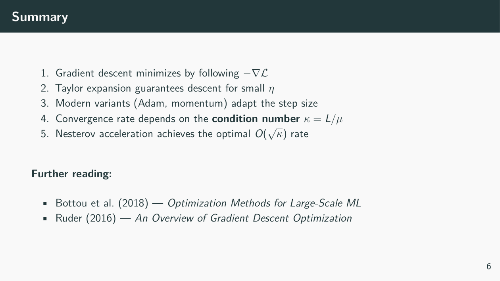

<div align="center">
  
  <br/><br/>

  [](https://docs.anthropic.com/en/docs/claude-code)
  [](https://pandoc.org)
  [](https://github.com/matze/mtheme)
  [](LICENSE)

  **[Install](#installation)** · **[Usage](#usage)** · **[Pipeline](#the-pipeline)** · **[Analyzer](#layout-analyzer)** · **[Examples](#examples)** · **[Fixes](#common-fixes)**
</div>

---


## What is this?

**markdown-to-slides** is a Claude Code skill that turns Markdown files into polished Beamer PDF slide decks — and then *checks its own work*.

You write slides in plain Markdown. The skill handles compilation via Pandoc, runs automated layout analysis to catch overflow and spacing issues, and iterates until the PDF is clean. No manual LaTeX debugging.

```
"Turn my notes into a 10-slide presentation on gradient descent"
```

That's it. The skill takes over: writes the markdown, compiles, analyzes layout, fixes issues, recompiles — and hands you a polished PDF.

<div align="center">
  <br/>
  
  <br/>
  <sub>The full compile → analyze → fix loop in action</sub>
  <br/><br/>
</div>

---

## Installation

### Claude Code (recommended)

```bash
# Clone and install as a skill
git clone https://github.com/SnehalRaj/markdown-to-slides.git ~/.claude/skills/markdown-to-slides
```

Or add the marketplace:

```bash
/plugin marketplace add https://github.com/SnehalRaj/markdown-to-slides-marketplace
/plugin install markdown-to-slides
```

### Prerequisites

```bash
# Pandoc (the converter)
brew install pandoc          # macOS
sudo apt install pandoc      # Ubuntu/Debian

# LaTeX with Beamer (the PDF engine)
brew install --cask mactex   # macOS (full) — or basictex for minimal
sudo apt install texlive-latex-recommended texlive-fonts-extra  # Ubuntu

# Layout analyzer (pick one)
pip install pdfplumber   # Lite — pure Python, always works
pip install PyMuPDF      # Full — faster, needs C compiler
```

### No sudo? (servers, containers, Codespaces)

```bash
# Pandoc — standalone binary
mkdir -p ~/local/bin
curl -sL https://github.com/jgm/pandoc/releases/download/3.6.4/pandoc-3.6.4-linux-amd64.tar.gz \
  | tar xz --strip-components=2 -C ~/local/bin
export PATH="$HOME/local/bin:$PATH"

# LaTeX — TinyTeX (no root needed)
curl -sL "https://yihui.org/tinytex/install-bin-unix.sh" | sh
export PATH="$HOME/.TinyTeX/bin/x86_64-linux:$PATH"
tlmgr install beamer metropolis pgfopts

# Analyzer — pure Python, no build tools
pip install pdfplumber
```

---


## The Pipeline

The skill runs an automated compile → analyze → fix loop:

| Step | What happens | Tool |
|------|-------------|------|
| 1. **Write** | Markdown with YAML frontmatter | Your editor / Claude |
| 2. **Compile** | `pandoc -t beamer --pdf-engine=pdflatex` | Pandoc |
| 3. **Analyze** | Check overflow, overlap, density | `analyze_slides.py` |
| 4. **Fix** | Adjust widths, split slides, trim text | Claude / you |
| 5. **Repeat** | Until no HIGH issues remain | Loop |

<br clear="both"/>

### Compile command

```bash
pandoc slides.md -t beamer --pdf-engine=pdflatex -o slides.pdf
```

### Analyze command

```bash
python tools/analyze_slides.py slides.pdf
```

---

## Usage

Just mention slides in any Claude Code conversation:

```bash
# Natural language — the skill triggers automatically
"Create slides summarizing our Q1 results"
"Update slide 5 to include the new benchmark table"
"The slides have overflow on slide 12, fix it"
"Convert my research notes into a presentation"

# Or invoke directly
/markdown-to-slides
```

---

## Layout Analyzer

Two analyzer versions are bundled — pick whichever installs on your system:

| Version | Install | Dependency |
|---------|---------|-----------|
| `analyze_slides.py` | `pip install PyMuPDF` | C extensions (faster, may need compiler) |
| `analyze_slides_lite.py` | `pip install pdfplumber` | Pure Python (always works) |

Both check every slide for the same layout issues:

| Issue | Severity | What it catches |
|-------|----------|----------------|
| `OVERFLOW` | 🔴 HIGH / 🟡 MED | Content below the footer boundary |
| `TEXT_OVERLAP` | 🔴 HIGH / 🟡 MED | Lines overlapping vertically |
| `RIGHT_MARGIN` | ⚪ LOW | Text past right edge |
| `DENSE` | 🟡 MED / 🔴 HIGH | >150 / >200 words per slide |
| `LARGE_IMAGE` | ⚪ LOW | Image >60% of slide area |

**Example output:**

```
Analyzing slides.pdf: 16 slides

Slide 1: Introduction  ✅ (42 words)
Slide 2: Background  ✅ (87 words)

Slide 3: Methodology
  Words: 215
  🔴 [OVERFLOW] Content extends 23px below footer area
      → "Additional notes on the experimental setup..."
  🔴 [DENSE] 215 words on this slide

Slide 4: Results  ✅ (95 words)

================================================================================

SUMMARY:
  Total slides: 16
  Slides with issues: 1 (3)
  Issue breakdown:
    OVERFLOW: 1
    DENSE: 1
```

---


## Markdown Format

Slides use standard Markdown with a YAML header for Beamer configuration:

```yaml
---
title: "My Presentation"
author: "Your Name"
date: "March 2026"
theme: "metropolis"
classoption: "aspectratio=169"
header-includes:
  - \usepackage{booktabs}
  - \usepackage{amsmath,amssymb}
  - \setbeamertemplate{navigation symbols}{}
  - \setbeamerfont{normal text}{size=\small}
  - \AtBeginDocument{\usebeamerfont{normal text}}
---

## First Slide

- Bullet points
- **Bold** and *italic*
- Math: $E = mc^2$ and $$\int_0^\infty e^{-x}\,dx = 1$$

---

## Second Slide

| Col A | Col B |
|-------|-------|
| data  | data  |

{width=70%}
```

**Key syntax:**
- `##` headers → slide titles
- `---` → slide separator
- `{width=XX%}` → image sizing
- Raw LaTeX works inline: `\vspace{}`, `\small`, `\footnotesize`

---

## Common Fixes

When the analyzer flags issues, here's the playbook:

| Problem | Fix |
|---------|-----|
| 🔴 OVERFLOW (image) | Reduce `{width=80%}` → `{width=65%}` |
| 🔴 OVERFLOW (text) | Shorten bullets or split into two slides |
| 🔴 DENSE (>200 words) | Remove verbose phrasing, split slide |
| 🟡 Table cramping | Add `\renewcommand{\arraystretch}{1.3}` before table |
| Need more vertical space | `\vspace{-0.5em}` to reclaim gaps |
| Everything too large | Change `size=\small` → `size=\footnotesize` in header |
| Two-column layout needed | Use `\begin{columns}...\end{columns}` |

---

## Showcase

These slides were generated from [`examples/showcase.md`](examples/showcase.md) — a 50-line Markdown file:

<div align="center">
<table>
<tr>
<td></td>
<td></td>
</tr>
<tr>
<td align="center"><sub>Title slide — auto-generated from YAML frontmatter</sub></td>
<td align="center"><sub>Display math, bullet points, bold emphasis</sub></td>
</tr>
<tr>
<td></td>
<td></td>
</tr>
<tr>
<td align="center"><sub>Multi-line equations with aligned notation</sub></td>
<td align="center"><sub>Professional tables with booktabs styling</sub></td>
</tr>
<tr>
<td></td>
<td></td>
</tr>
<tr>
<td align="center"><sub>Theorem-style content with key quantities</sub></td>
<td align="center"><sub>Clean numbered summary with references</sub></td>
</tr>
</table>
</div>

> **All 6 slides from 50 lines of Markdown.** No LaTeX was written by hand — just standard Markdown with `$$math$$` and `| tables |`.

---

## Examples

See [`examples/minimal.md`](examples/minimal.md) for a starter template and [`examples/showcase.md`](examples/showcase.md) for the full deck above.

```bash
# Compile the showcase
pandoc examples/showcase.md -t beamer --pdf-engine=pdflatex -o examples/showcase.pdf

# Analyze it
python tools/analyze_slides.py examples/showcase.pdf
```

---

## Project Structure

```
markdown-to-slides/
├── .claude-plugin/
│   └── plugin.json              # Claude Code plugin metadata
├── skills/
│   └── markdown-to-slides/
│       └── SKILL.md             # Skill definition (auto-loaded)
├── tools/
│   ├── analyze_slides.py        # PDF layout analyzer (PyMuPDF)
│   └── analyze_slides_lite.py   # Lite version (pdfplumber, pure Python)
├── examples/
│   ├── minimal.md               # Starter template
│   └── showcase.md              # Full showcase deck (gradient descent)
├── scripts/
│   ├── pdf_to_png.py            # Convert PDF slides to PNG images
│   └── make_demo_gif.py         # Generate the terminal demo GIF
├── assets/
│   ├── logo.svg                 # Project logo
│   ├── demo.gif                 # Terminal demo animation
│   ├── mascot-*.svg             # Slide mascot characters
│   └── showcase/                # Rendered slide screenshots
├── LICENSE
└── README.md
```

---

## Supported Themes

The skill defaults to [Metropolis](https://github.com/matze/mtheme) (clean, modern, widely available), but any Beamer theme works:

```yaml
theme: "metropolis"    # Default — clean, minimal
theme: "Madrid"        # Classic academic
theme: "Berlin"        # Navigation sidebar
theme: "CambridgeUS"   # Red accents
```

---

## Manual Usage (without Claude Code)

The tools work standalone:

```bash
# 1. Write your markdown (see examples/minimal.md)

# 2. Compile
pandoc your_slides.md -t beamer --pdf-engine=pdflatex -o your_slides.pdf

# 3. Analyze (pick one)
pip install pdfplumber                              # pure Python
python tools/analyze_slides_lite.py your_slides.pdf
# OR
pip install PyMuPDF                                 # faster, needs compiler
python tools/analyze_slides.py your_slides.pdf

# 4. Fix flagged issues in your .md file, repeat from step 2
```

---

## License

[MIT](LICENSE) — use it however you want.

<div align="center">
  <sub>Write slides, not LaTeX.</sub>
</div>
