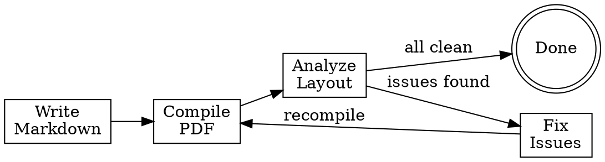

# Markdown to Slides

Pandoc + Beamer pipeline for creating PDF slide decks from markdown, with automated layout analysis and iterative spacing refinement.

## Pipeline



**Steps:**

1. **Write markdown** with YAML frontmatter (see format below)
2. **Compile**: `pandoc INPUT.md -t beamer --pdf-engine=pdflatex -o OUTPUT.pdf`
3. **Analyze**: `python analyze_slides.py OUTPUT.pdf` (bundled in this skill's `tools/` directory)
4. **Fix** any HIGH/MEDIUM issues flagged
5. **Repeat** steps 2-4 until no HIGH issues remain
6. **Visual check**: Read the PDF to verify it looks good

## Markdown Format

```yaml
---
title: "Slide Title"
subtitle: "Optional Subtitle"
author: "Author Name"
date: "Month Year"
theme: "metropolis"
classoption: "aspectratio=169"
header-includes:
  - \usepackage{booktabs}
  - \usepackage{amsmath,amssymb}
  - \setbeamertemplate{navigation symbols}{}
  - \setbeamerfont{normal text}{size=\small}
  - \AtBeginDocument{\usebeamerfont{normal text}}
---

## Slide Title

Content here. Use standard markdown.

- Bullet points
- **Bold** and *italic*
- Math: $inline$ and $$display$$

| Column | Column |
|--------|--------|
| data   | data   |

{width=70%}

---

## Next Slide

Three dashes `---` separate slides.
```

**Key rules:**
- `##` headers become slide titles
- `---` (horizontal rule) forces a new slide
- Images: `{width=XX%}` controls size (start at 70%, reduce if overflow)
- Tables: use `booktabs` style via `\usepackage{booktabs}`
- Raw LaTeX works inline: `\vspace{-0.5em}`, `\small`, `\footnotesize`

## Analyzer Tool

The `analyze_slides.py` script (in `tools/`) checks for:

| Issue | Severity | Meaning |
|-------|----------|---------|
| OVERFLOW | HIGH/MED | Content extends below footer area |
| TEXT_OVERLAP | HIGH/MED | Lines overlap vertically |
| RIGHT_MARGIN | LOW | Text past right margin |
| DENSE | MED/HIGH | >150/200 words per slide |
| LARGE_IMAGE | LOW | Image >60% of slide area |

**Requires:** `pip install PyMuPDF` (the `fitz` package)

**Usage:**
```bash
python tools/analyze_slides.py path/to/slides.pdf
```

## Common Fixes

| Problem | Fix |
|---------|-----|
| OVERFLOW (image) | Reduce `{width=80%}` to `{width=65%}` |
| OVERFLOW (text) | Shorten bullets, split into two slides |
| DENSE slide | Remove verbose phrasing, split slide |
| Table cramping | Add `\renewcommand{\arraystretch}{1.3}` before table |
| Need more space | Use `\vspace{-0.5em}` to reclaim vertical space |
| Global font too large | Add `\setbeamerfont{normal text}{size=\footnotesize}` to header-includes |
| Content too wide | Wrap in `\begin{columns}...\end{columns}` for two-column layout |

## Common Mistakes

- **Forgetting `---` separators**: Without them, pandoc puts everything on one giant slide
- **Image paths**: Must be relative to where you run pandoc from (usually project root)
- **Math mode**: Use `$$` not `\[...\]` for display math in markdown
- **Tables need booktabs**: Without `\usepackage{booktabs}`, `\toprule`/`\midrule` fail
- **Not iterating**: One compile-analyze cycle is rarely enough. Budget 2-3 rounds.
